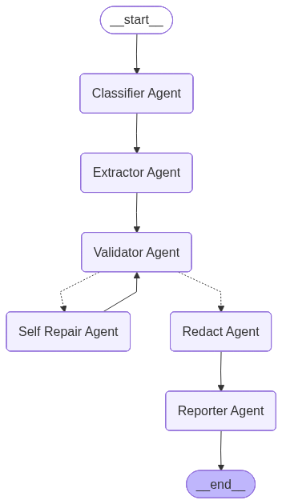

# 🧠 Agentic DocPro (Agentic Document Processor)

## 📘 Overview
**Agentic DocPro** is a modular **document processing pipeline** that leverages **large language models (LLMs)** to automatically process, validate, repair, redact, and summarize documents. It supports **PDF/DOC files** and outputs structured JSON along with detailed performance insights.

### 🔍 What It Does
1. **Document Ingestion** – Extracts text, tables, and images from PDF/DOC files using `unstructured`.  
2. **Chunking** – Splits documents into manageable chunks with configurable maximum images per chunk.  
3. **LLM Processing** – Uses multiple LLM agents to:
   - Classify documents
   - Extract entities and structured data
   - Validate against Pydantic schemas
   - Self-repair extracted JSON if validation fails
   - Redact personally identifiable information (PII)
   - Summarize text, tables, and images  
4. **JSON Aggregation** – Combines chunk-level outputs into a single document-level JSON.  
5. **Responsible AI Logging** – Tracks self-repair attempts, token usage, and agent traces.  
6. **Performance Reporting** – Provides step-wise latency, model evaluation metrics, and insights into best-performing models.

---

## 🧰 Tech Stack

| Category | Technology Used |
|-----------|----------------|
| Programming Language | Python 3.11+ |
| NLP/LLM Framework | LangChain, Groq |
| Document Parsing | unstructured, pytesseract |
| LLM Models | LLaMA 3.x, OpenAI GPT OSS |
| Data Validation | Pydantic |
| Frontend | Streamlit |
| API | FastAPI, Uvicorn |
| JSON Handling | Python JSON module |
| Logging | Custom agent traces |

---

## ⚙️ Project Workflow

1. **Ingest Document** – Load PDF/DOC and extract elements (text, tables, images)  
2. **Chunk Document** – Split into chunks with a maximum number of images per chunk  
3. **Summarize Chunks** – Generate structured JSON for each chunk using LLMs  
4. **Aggregate JSON** – Merge chunk-level JSON into a single document-level output  
5. **Run Workflow Graph** – Process through agent nodes:
   - Classifier
   - Extractor
   - Validator
   - Self-Repair
   - Redactor
   - Reporter  
6. **Produce Final Report** – Includes extracted data, redacted data, metrics, token usage, and latency

---

## 🤖 Agentic Graph


---


---

## 🧩 Folder Structure


---

```
├── agents/ # LLM agent implementations
│ ├── classifieragent.py
│ ├── extractoragent.py
│ ├── validatoragent.py
│ ├── self_repair_extractor.py
│ ├── redactagent.py
│ └── reporteragent.py
├── steps/ # Pipeline steps
│ ├── ingestion.py
│ ├── chunking.py
│ ├── summarizechunk.py
│ └── json_aggregator.py
├── graph/ # Workflow graph
│ └── graph.py
|── node/
| └── nodes.py
├── states/
| └── state.py
├── pipeline.py # Orchestration pipeline
├── streamlit_app.py # Streamlit frontend
├── fastapi_app.py # FastAPI backend
├── prompts/ # LLM prompt templates
│ ├── self_repair_extractor_prompts.py
| └── extractor_prompt.py
| └── redact_prompts.py
| └── self_repair_extractor_prompts.py
| └── signal_summarizer_prompt.py
├── schemas/ # Pydantic schemas for validation
│ ├──validator_schemas.py
├── test_data/ # Sample documents
└── README.md
```


---

---

## 💻 Requirements

- Python 3.11+
- Groq API key or OpenAI credentials
- `unstructured`, `pandas`, `streamlit`, `fastapi`, `pydantic`, `langchain-core`, `tenacity`
- Tesseract OCR installed for image extraction
- Optional LLaMA or OpenAI models for LLM processing


**Clone the repository**

```bash
git clone 
cd <repository_name>
```

### 📦 Install Dependencies

```bash
pip install -r requirements.txt
```
**🔧 Set Environment Variables**
```bash
Create a .env file:

GROQ_API_KEY=<your_groq_api_key>
```

## 🚀 How to Run

### 1️⃣ Streamlit Interface

Run the Streamlit frontend to interact with the pipeline:

```bash
streamlit run app_fast.py
```
Streamlit for Offline usage:

```bash
streamlit run app_local.py
```

### 2️⃣ FastAPI Backend

Run the FastAPI server:

```bash
uvicorn fastapi_app:app --reload
```

## 📊 Output Format

```
{
    "extracted_json": { ... },
    "redacted_json": { ... },
    "self_repair": [ ... ],
    "token_usage": [ ... ],
    "agent_traces": [ ... ],
    "latency_seconds": ...,
    "step_timings": {
        "ingestion": ...,
        "chunking": ...,
        "summarization": ...,
        "aggregation": ...,
        "graph_execution":...
    }
}
```


## ❓ Tesseract Path FAQ

### 1️⃣ Why do I need to set the Tesseract path?
The **Tesseract executable** is not always on your system PATH by default.  
If Python cannot locate it, the OCR step will fail.  
Setting the path ensures that **Agentic DocPro** can correctly invoke Tesseract for image-to-text conversion.

---

### 2️⃣ How do I set the Tesseract path in Python?
Use the `unstructured_pytesseract` module to specify the exact location of `tesseract.exe`:

```python
import unstructured_pytesseract

# Replace with your actual installation path
unstructured_pytesseract.pytesseract.tesseract_cmd = r"C:\Users\YourUser\tesseract\tesseract.exe"
